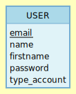

#PROJET PAGE DE CONNEXION / DECONNEXION

Ici il s'agit de créer une interphace où un utilisateur lambda peut créer un compte, se connecter, se déconnecter, supprimer/ modifier ses données personnelles.
Mise en place du CREUD également pour l'administrateur.

# User Stories

|En tant que|Je veux pouvoir| Dans le but de|
|---|---|---|
|Utilisateur|Créer un compte|Devenir membre|
|Membre|Me connecter|Profiter pleinement du site|
|Membre|Me Déconnecter|Partir du site|
|Membre|Modifier mes données personelles|mettre à jour mon profil|
|Membre|Supprimer mon compte|Partir du site|
|Membre|Afficher mes données personelles|Consulter mes données|
|Administrateur|Supprimer un compte|supprimer un membre|
|Administrateur|Ajouter un compte|ajouter un membre|
|Administrateur|Me connecter|Gérer le site|
|Administrateur|Me Déconnecter|Partir du site|

# MCD - MLD

